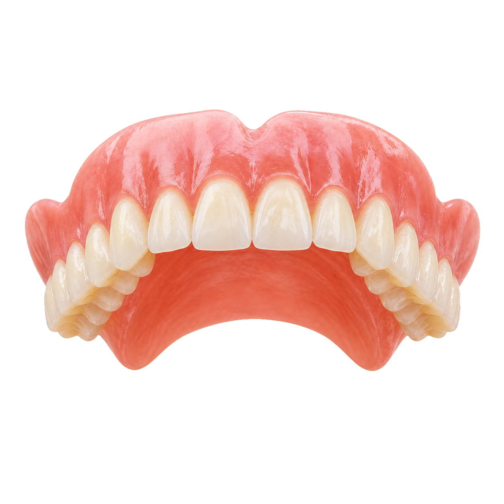
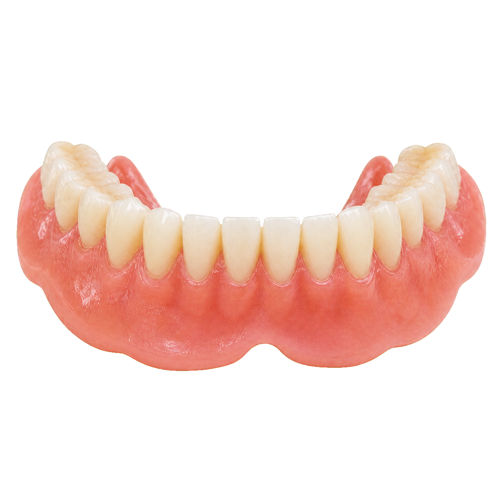
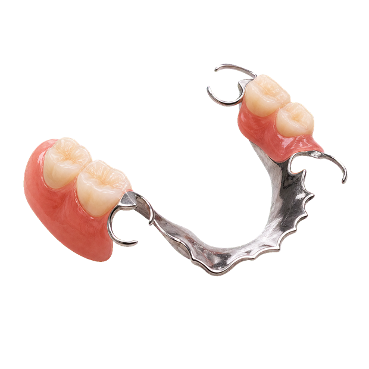

# Labucal Website

Sitio web estatico para **Labucal**, laboratorio de protesis dentaria en Sorocaba, Brasil.

Produccion:

- Sitio: <https://pcxddg.github.io/labucal/>
- Repositorio: <https://github.com/Pcxddg/labucal>

Este proyecto no usa framework ni build step. Todo esta hecho con HTML, CSS y JavaScript vanilla para que sea facil de mantener y publicar en GitHub Pages.

## Estructura

```text
.
|-- index.html
|-- Labucal.html
|-- privacidade.html
|-- .github/
|   `-- workflows/
|       `-- update-reviews.yml
|-- scripts/
|   `-- fetch-reviews.js
|-- data/
|   `-- reviews.json   (auto-generado, no editar a mano)
|-- assets/
|   |-- brand/
|   |-- decor/
|   `-- labucal-images/
`-- docs/
```

### Archivos principales

- `index.html`: archivo de entrada publicado por GitHub Pages. Es el archivo que abre el navegador en produccion.
- `Labucal.html`: copia de trabajo historica del sitio. Debe mantenerse sincronizada con `index.html`.
- `privacidade.html`: pagina de Politica de Privacidade en cumplimiento de la LGPD. Enlazada desde el footer del sitio principal.
- `.github/workflows/update-reviews.yml`: workflow que cada 6 h consulta Google Places y actualiza `data/reviews.json`. Ver seccion "Avaliacoes do Google" mas abajo.
- `scripts/fetch-reviews.js`: script Node ejecutado por el workflow. Llama a la Places API (New) y graba el JSON.
- `data/reviews.json`: datos de avaliacoes del Google (rating, conteo, link al perfil, hasta 5 reviews con texto). **Auto-generado por el workflow — no editar a mano**. El sitio lo lee desde el navegador para hidratar el popup de avaliacoes.
- `assets/brand/`: logo optimizado, favicon y apple touch icon.
- `assets/decor/`: protesis transparentes decorativas usadas en animaciones por scroll.
- `assets/labucal-images/`: fotos, fondo del hero, protesis principales y galeria.
- `.gitignore`: ignora el logo fuente pesado original y carpetas temporales.

Importante: si se modifica `Labucal.html`, copiar el resultado a `index.html` antes de publicar:

```powershell
Copy-Item -LiteralPath "Labucal.html" -Destination "index.html" -Force
```

Si se modifica `index.html`, hacer el movimiento inverso:

```powershell
Copy-Item -LiteralPath "index.html" -Destination "Labucal.html" -Force
```

## Identidad visual

La identidad se define en variables CSS dentro de `:root`:

```css
--ink-900: #0A1B3D;
--ink-800: #142A5C;
--ink-600: #2E4A8C;
--ink-300: #7BA7E1;
--bone: #F8F7F4;
--white: #FFFFFF;
--text: #1A1A1A;
--muted: #6B6B6B;
```

Buenas practicas:

- Mantener el azul oscuro como color principal.
- Usar `--ink-300` como acento, no como color dominante.
- Conservar el contraste alto en textos sobre fondos oscuros.
- Evitar introducir paletas nuevas sin actualizar todo el sistema visual.
- Evitar degradados decorativos fuertes. El sitio ya usa profundidad por fotografia, protesis y sombras suaves.

## Secciones

El HTML esta organizado por comentarios grandes:

```html
<!-- ============ NAV ============ -->
<!-- ============ HERO ============ -->
<!-- ============ VALUE PROP ============ -->
<!-- ============ SERVICES ============ -->
<!-- ============ PROCESS ============ -->
<!-- ============ GALLERY ============ -->
<!-- ============ NETWORK / CONSTELLATION ============ -->
<!-- ============ CONTACT ============ -->
<!-- ============ FAQ ============ -->
<!-- ============ FOOTER ============ -->
<!-- ============ LABUCALZINHO ============ -->
```

Cada seccion tiene un `id` usado por la navegacion. No cambiar esos ids sin actualizar tambien los enlaces del nav, menu mobile y footer:

- `#servicos`
- `#processo`
- `#galeria`
- `#rede`
- `#contato`
- `#faq`

## Assets

### Logo y favicon

La fuente pesada original del logo esta ignorada por Git:

```text
522632165_18321130222238761_7326127144279536769_n_upscayl_16x_upscayl-standard-4x-Photoroom.png
```

No usar ese archivo directamente en el HTML. Usar las versiones optimizadas:

- `assets/brand/labucal-logo-96.png`: logo en header y footer.
- `assets/brand/labucal-logo-192.png`: version grande.
- `assets/brand/favicon.ico`: favicon principal.
- `assets/brand/favicon-32.png`: favicon PNG.
- `assets/brand/apple-touch-icon.png`: icono para iOS.

### Imagenes principales

- `assets/labucal-images/hero-lab-bg.jpg`: fondo fotografico del hero, con overlay azul.
- `assets/labucal-images/prosthesis-part-01-upper.png`: parte superior de la protesis animada del hero.
- `assets/labucal-images/prosthesis-part-02-lower.png`: parte inferior de la protesis animada del hero.
- `assets/labucal-images/gallery-01.jpg` a `gallery-06.jpg`: galeria.
- `assets/labucal-images/service-*.jpg`: miniaturas de servicios.

### Decoraciones animadas

Las protesis decorativas por seccion viven en:

```text
assets/decor/
|-- decor-bridge.png
|-- decor-implant.png
|-- decor-partial.png
`-- decor-veneers.png
```

Son PNG con transparencia y se mueven con el scroll. Deben mantenerse livianas. Como regla practica, intentar que cada decorativo pese menos de 250 KB.

## Animaciones

El sitio usa tres tipos de animacion:

1. **Reveal on scroll**: elementos con clase `.reveal`.
2. **Hero prosthesis assembly**: protesis del hero en dos capas que se arma al bajar.
3. **Section prosthesis decor**: protesis decorativas que se desplazan, rotan y escalan con el scroll.

### Reveal

Para hacer que un bloque entre suavemente:

```html
<div class="section-head reveal">
  ...
</div>
```

El JavaScript observa `.reveal` con `IntersectionObserver` y agrega `.in` cuando entra en pantalla.

### Protesis del hero

Markup:

```html
<div class="prosthesis assembly" id="prosthesisAssembly">
  
  
</div>
```

El movimiento se controla con variables CSS:

- `--prosthesis-upper-y`
- `--prosthesis-lower-y`
- `--prosthesis-scale`

El JS calcula esas variables a partir de `window.scrollY`. Para cambiar la velocidad del cierre, editar esta parte:

```js
const raw = window.scrollY / Math.min(760, vh * 0.82);
```

Un divisor mayor hace la animacion mas lenta. Un divisor menor la hace mas rapida.

### Decoracion por seccion

Para agregar una protesis animada a una seccion:

```html
<section class="dark pad with-prosthesis" id="servicos" aria-labelledby="serv-h">
  
  ...
</section>
```

Clases disponibles:

- `with-prosthesis`: habilita decoracion con overflow controlado.
- `section-prosthesis`: base visual y animable.
- `decor-left`: posiciona desde la izquierda.
- `decor-right`: posiciona desde la derecha.
- `decor-high`: posicion alta.
- `decor-low`: posicion baja.
- `decor-slim`: pieza estrecha.
- `decor-small`: pieza secundaria mas discreta.

Valores de `data-scroll-decor`:

- `left`: entra y se mueve desde la izquierda.
- `right`: entra y se mueve desde la derecha.
- `float`: movimiento flotante con seno, util para piezas pequenas.

Evitar poner decoraciones encima de formularios, botones o texto principal. Siempre revisar en desktop y mobile.

## Contacto y mapa

Datos actuales:

- Telefono: `(15) 3418-6119`
- E-mail: `contato@labucal.com.br`
- Facebook: <https://www.facebook.com/labucalprotese>
- Instagram: <https://www.instagram.com/labucalprotese/>
- Direccion: `Rua Conego Januario Barbosa, 225, Jardim Vergueiro, Sorocaba, Brazil`

El mapa usa OpenStreetMap embebido, sin API key:

```html
https://www.openstreetmap.org/export/embed.html?...&marker=-23.5084267%2C-47.4584548
```

Tambien hay un enlace a Google Maps para abrir ruta. Si cambia la direccion, actualizar:

- Texto visible en contacto.
- Texto visible en footer.
- URL del iframe OpenStreetMap.
- URL de Google Maps.

## Avaliacoes do Google (live data)

El popup de avaliacoes en la esquina inferior izquierda se hidrata con datos reales del Google Business del laboratorio. El flujo:

1. Un workflow `.github/workflows/update-reviews.yml` corre cada 6 horas.
2. Ejecuta `scripts/fetch-reviews.js` que consulta la Places API (New) de Google.
3. Graba `data/reviews.json` y lo commitea al `main` (solo si hubo cambios reales).
4. El JS del sitio en el navegador hace `fetch('data/reviews.json')` al cargar la pagina y actualiza estrellas, rating y enlace del popup. Si el archivo todavia no existe, el popup queda con el conteudo estatico.

### Setup inicial (una sola vez)

1. **Crear un proyecto en Google Cloud Console**: <https://console.cloud.google.com/>
2. **Habilitar Places API (New)** en el proyecto.
3. **Crear una API key**: APIs & Services > Credentials > Create Credentials > API key. Restringir la key a "Places API (New)" en API restrictions.
4. **Activar facturacion** en el proyecto (sin esto la API no responde). El plan free incluye USD 200 de credito mensual, mas que suficiente para 4 llamadas al dia.
5. **Obtener el Place ID** del Labucal en Google Maps: <https://developers.google.com/maps/documentation/javascript/place-id#find-id>. Buscar "Labucal Sorocaba" y copiar el ID (empieza con `ChIJ...`).
6. **Editar `.github/workflows/update-reviews.yml`** y reemplazar `REPLACE_WITH_PLACE_ID` por el Place ID real.
7. **Crear el Secret en GitHub**: en <https://github.com/Pcxddg/labucal/settings/secrets/actions> > New repository secret > nombre `GOOGLE_PLACES_API_KEY` > valor la API key del paso 3.
8. **Ejecutar el workflow manualmente la primera vez**: en la pestana Actions del repo > "Update Google Reviews" > Run workflow. Eso genera `data/reviews.json` por primera vez.

A partir de ahi, el workflow corre solo cada 6 horas. Cada vez que un cliente deja una resena nueva en Google, en maximo 6 horas el sitio refleja el cambio.

### Estructura del JSON

```json
{
  "updatedAt": "2026-05-24T15:00:00.000Z",
  "name": "Labucal",
  "rating": 4.9,
  "userRatingCount": 50,
  "googleMapsUri": "https://maps.google.com/?cid=...",
  "reviews": [ { "author": "...", "rating": 5, "text": "...", "relativeTime": "..." } ]
}
```

### Costos

Con 4 llamadas al dia (~120 al mes) usando el FieldMask actual (Pro + Atmosphere por incluir `reviews`), el costo mensual estimado es menor a USD 1, totalmente absorbido por el credito gratuito de USD 200 que Google da cada mes.

## Publicacion

El sitio se publica desde la rama `main` con GitHub Pages.

Flujo recomendado:

```powershell
git status -sb
git add Labucal.html index.html assets docs README.md
git commit -m "Descripcion corta del cambio"
git push
```

Despues de hacer push, revisar:

```powershell
gh api repos/Pcxddg/labucal/pages
```

El estado debe terminar en:

```json
"status": "built"
```

## Checklist antes de publicar

- `index.html` y `Labucal.html` estan sincronizados.
- No hay capturas temporales en `assets/`.
- No se subio el logo fuente pesado original.
- Todas las rutas `src="assets/..."`, `href="assets/..."` y `url("assets/...")` existen.
- El sitio carga en desktop.
- En mobile no aparecen decoraciones que tapen contenido.
- Los enlaces externos abren en una nueva pestana cuando salen del sitio.
- El mapa sigue respondiendo.

## Validacion rapida de rutas

En PowerShell:

```powershell
$html = Get-Content -Raw -Path "index.html"
$refs = @()
$refs += [regex]::Matches($html, 'href="(assets/[^"]+)"') | ForEach-Object { $_.Groups[1].Value }
$refs += [regex]::Matches($html, 'src="(assets/[^"]+)"') | ForEach-Object { $_.Groups[1].Value }
$refs += [regex]::Matches($html, 'url\("(assets/[^"]+)"\)') | ForEach-Object { $_.Groups[1].Value }
$refs | Sort-Object -Unique | ForEach-Object {
  [pscustomobject]@{ Path = $_; Exists = Test-Path $_ }
} | Format-Table -AutoSize
```

## Buenas practicas de mantenimiento

- Mantener cambios pequenos y revisables.
- No mezclar redisenos visuales con cambios de contenido.
- Optimizar imagenes antes de agregarlas al repo.
- Usar `loading="lazy"` en imagenes que no esten en el primer viewport.
- Mantener `alt="" aria-hidden="true"` en imagenes puramente decorativas.
- Usar `target="_blank" rel="noopener"` para enlaces externos.
- Revisar contraste cuando se cambie el fondo del hero o la opacidad.
- Evitar JavaScript pesado: este sitio debe seguir cargando rapido como pagina estatica.
- No depender de servicios con API key para funciones simples.

## Documentacion adicional

Ver tambien:

- [Guia de edicion y diseno](docs/EDITING_GUIDE.md)
